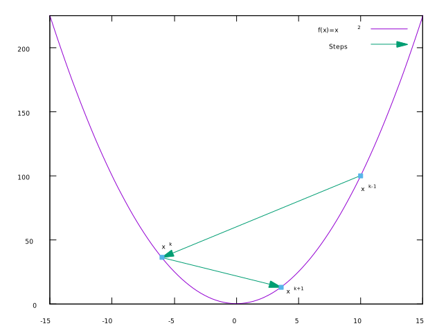

# Gradient Descent

## Example of Gradient Descent
This section provides a basic example of gradient descent. The idea is to find the minimum value of
_x_ for the given function _f(x)_.

### Given
- f(x) = x2
- ∇f(x) = 2x
- x(k-1) = 10
- t = 0.8

### Calculating x(k)
x(k) = x(k-1) - t∇f(x(k-1))

x(k) = 10 - 0.8(2)(10)

x(k) = 6

### Calculating x(k+1)
x(k+1) = x(k) - t∇f(x(k))

x(k+1) = -6 - 0.8(2)(-6)

x(k+1) = 3.6

### Visualization
The graph below shows these two iterations.

